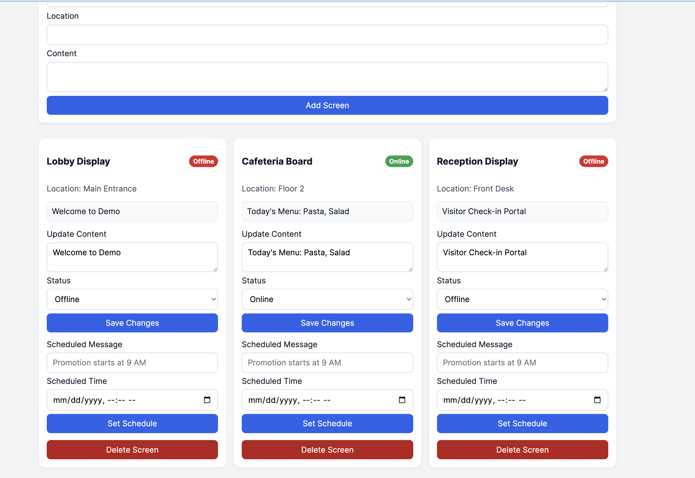

# Digital Signage Dashboard

A full-stack web application to manage digital signage screens across locations.  
You can view all screens, add new ones, update screen status/content, delete screens, and schedule content updates.

## What The App Does

- Displays all screens in a dashboard card grid
- Shows each screen's name, location, online/offline status badge, and current content
- Supports adding new screens
- Supports editing existing screens (content and status)
- Supports deleting screens
- Supports scheduling a message at a specific date/time for each screen

## Tech Stack

- **Frontend:** React + TypeScript + Axios + plain CSS
- **Backend:** Node.js + Express.js
- **Database:** MySQL
- **ORM:** Sequelize

## Folder Structure

```text
digital-signage-dashboard/
├── client/
│   ├── src/
│   │   ├── components/
│   │   │   ├── ScreenCard.tsx
│   │   │   └── ScreenForm.tsx
│   │   ├── services/
│   │   │   └── api.ts
│   │   ├── App.tsx
│   │   ├── main.tsx
│   │   ├── styles.css
│   │   └── types.ts
│   ├── index.html
│   ├── package.json
│   ├── tsconfig.json
│   ├── tsconfig.app.json
│   ├── tsconfig.node.json
│   └── vite.config.ts
├── server/
│   ├── src/
│   │   ├── config/
│   │   │   └── database.js
│   │   ├── controllers/
│   │   │   └── screenController.js
│   │   ├── models/
│   │   │   └── screen.js
│   │   ├── routes/
│   │   │   └── screenRoutes.js
│   │   └── index.js
│   ├── .env.example
│   └── package.json
└── README.md
```

## Database Model

Sequelize creates a `screens` table automatically on server start (`sequelize.sync()`), with these fields:

- `id`
- `name`
- `location`
- `status` (`online` or `offline`)
- `content`
- `scheduledMessage`
- `scheduledTime`
- `lastUpdated`

## Installation and Setup

### Prerequisites

- Node.js 18+
- npm
- MySQL running locally

### 1) Clone and Install

From the project root:

```bash
cd server
npm install

cd ../client
npm install
```

### 2) Configure Server Environment

Copy `server/.env.example` to `server/.env` and update values:

```env
DB_HOST=localhost
DB_USER=root
DB_PASSWORD=yourpassword
DB_NAME=signage_db
PORT=5050
# Optional — bind address for the API (do not use HOST; many shells set that)
SERVER_HOST=127.0.0.1
```

### 3) Start the Backend

```bash
cd server
npm run dev
```

Backend runs at `http://127.0.0.1:5050`.

### 4) Start the Frontend

In a second terminal:

```bash
cd client
npm run dev
```

Frontend runs at `http://localhost:5173`.

## API Endpoints

Base URL: `http://127.0.0.1:5050/api/screens`

- `GET /` - fetch all screens
- `POST /` - create a new screen
  - body: `{ "name": "Main Lobby", "location": "Floor 1", "content": "Welcome!" }`
- `PUT /:id` - update a screen's content and/or status
  - body: `{ "content": "New content", "status": "online" }`
- `DELETE /:id` - delete a screen
- `PATCH /:id/schedule` - set scheduled message and time
  - body: `{ "scheduledMessage": "Promo starts soon", "scheduledTime": "2026-04-15T18:00:00" }`

## Error Handling

- All API routes use `async/await`
- Standard `try/catch` error handling returns clear error messages and HTTP status codes

## Screenshots

Add screenshots here after running the app:

- Dashboard view: 
- Add screen form: ``
- Scheduler example: ``

